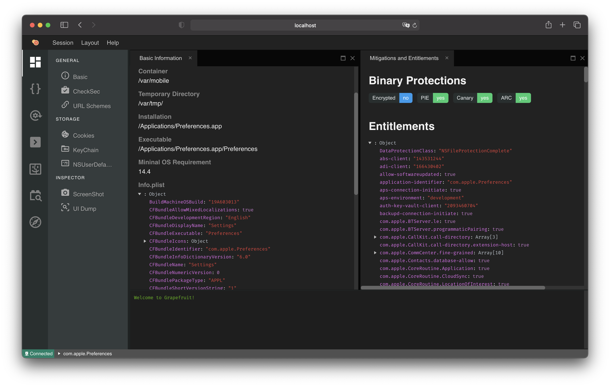

# Grapefruit: Runtime Application Instruments for iOS

## Get Started

Git clone:

`git clone --recurse-submodules https://github.com/ChiChou/Grapefruit`

Install dependencies:

* node.js v12.x (for 14.x, there is a known issue that will cause the server to unexpectly crash)
* tmux (or Windows Terminal on Windows)

Install npm packages:

`npm run installdev`

Start development server:

`npm run dev`

Default webpack url is `http://localhost:8080`

## FAQ

* [How do I decide which version of nodejs to use?](https://github.com/ChiChou/Grapefruit/wiki/How-do-I-decide-which-version-of-nodejs-to-use%3F)
* [Frida CRITICAL: No such interface re.frida.HostSession*](https://github.com/ChiChou/Grapefruit/wiki/Frida-CRITICAL:-No-such-interface-re.frida.HostSession*)

## Discord Group

If you have experienced anything wrong or want to suggest new features, please join my Discord channel! https://discord.gg/pwutZNx

## Roadmap

https://github.com/ChiChou/Grapefruit/projects/1
