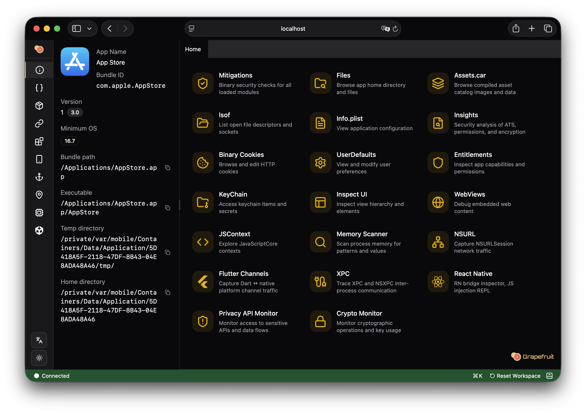
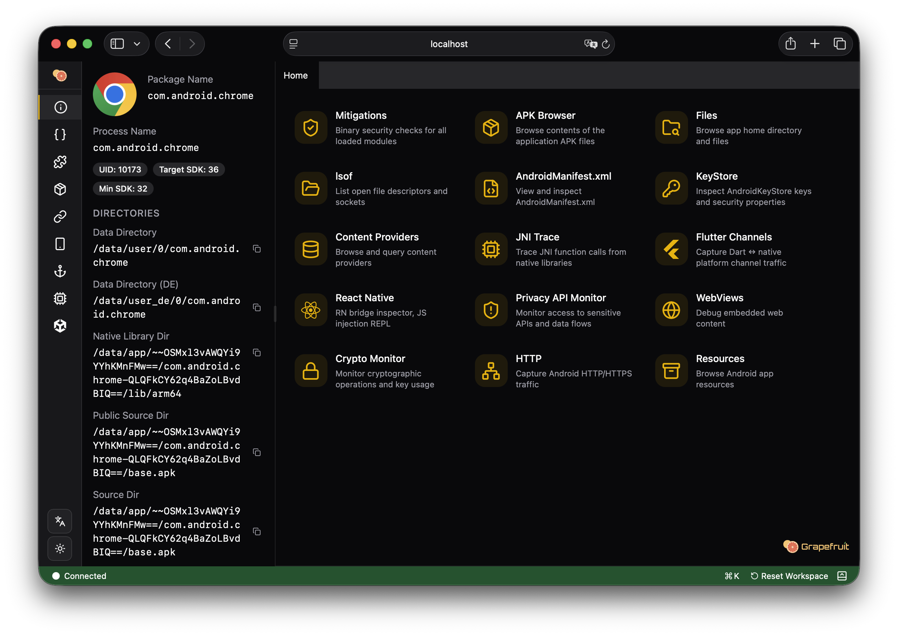

<p align="center">
    
</p>

# Grapefruit: Open-source mobile security testing suite

[](https://discord.com/invite/pwutZNx)
[](https://www.npmjs.com/package/igf)
[](https://github.com/ChiChou/Grapefruit/commits/master)
[](https://github.com/ChiChou/Grapefruit/graphs/contributors)
[](https://github.com/ChiChou/Grapefruit/blob/master/LICENSE)

Runtime mobile application instrumentation toolkit powered by [Frida](https://frida.re).
Inspect, hook, and modify mobile apps through a web-based interface.

Now it supports both iOS and Android!

## Quick Start

Requires [Frida](https://frida.re) server running on your device. Follow the [official setup guides](https://frida.re/docs/ios/)([Android](https://frida.re/docs/android/)) first.

**npm (recommended)**

```sh
npm install -g igf
igf
```

**Or run without installing**

```sh
npx igf
```

**Prebuilt binaries** for macOS, Linux, and Windows are available on [GitHub Releases](https://github.com/chichou/grapefruit/releases).

Note: even we use `bun` as primary development environment, and the prebuilt single binaries are bun based,
the package on npm is not compatible with bun, do not use `bunx` to run.

## Features

- **Runtime Method Hooking** - Intercept native and managed functions with structured logging
- **Cryptographic API Interception** - Monitor encryption/decryption operations with data capture
- **Filesystem Browser** - Navigate, upload, download, and inspect files with hex/text preview
- **SQLite Database Inspection** - Browse tables, run queries, and view results
- **Syslog Streaming** - Real-time system and agent log monitoring
- **Process Crash Reporting** - Exception handler with register dump and backtrace
- **Flutter Support** - Monitor platform method channel communication on both platforms
- **React Native Support** - Bridge inspector and JavaScript injection REPL
- **Memory Scanner** - Search and inspect process memory
- **Privacy Monitor** - Track sensitive API access (camera, microphone, location, sensors, etc.)
- **Thread Inspector** - View and manage process threads
- **Module/Symbol Browser** - Inspect loaded modules and exported symbols
- **Analysis & Decompilation** - DEX, Hermes bytecode, and native code. AI assistance available for hook script generation

### iOS



- Keychain access and modification
- NSURL session traffic capture (HTTP/HTTPS/WebSocket)
- WebView and JSContext inspection with JavaScript execution
- UI hierarchy dump and element highlighting
- Info.plist, entitlements, and binary cookie viewers
- Biometric (Touch ID / Face ID) bypass
- UserDefaults browser
- Pasteboard and file operation monitoring
- Geolocation spoofing
- Device ID spoofing
- Objective-C class and method inspection
- Open file handles and network connections (lsof)
- Security analysis (PIE, ARC, stack canaries, encryption)
- Asset catalog viewer (Assets.car)
- XPC/NSXPC message inspection

### Android



- AndroidManifest.xml decoder and component browser (activities, services, receivers, providers)
- Android Keystore inspection with key attributes
- Content provider query, insert, update, and delete
- JNI call tracing with arguments, return values, and backtraces
- Java class inspection (methods, fields, interfaces)
- Intent building and launching
- Open file handles and network connections (lsof)
- HTTP traffic capture (OkHttp, Volley, URLConnection)
- Resources browser
- Clipboard and SharedPreferences monitoring
- Broadcast receiver monitoring

## Scope and Non-Goals

This project does not include built-in bypasses for anti-tampering protections:

- Frida detection bypass
- SSL/TLS certificate pinning bypass
- Jailbreak or root detection bypass

**Rationale:** RASP (Runtime Application Self-Protection) solutions evolve continuously to detect instrumentation frameworks. Maintaining effective bypasses requires ongoing effort to keep pace with new detection methods, introducing significant maintenance burden and potential stability issues. These bypasses are also highly application-specific, making general-purpose solutions fragile.

Rather than shipping brittle built-in bypasses, Grapefruit focuses on instrumentation and inspection capabilities that compose well with dedicated bypass tooling.

**Recommended approaches** for authorized assessments where RASP bypass is required:

1. **Frida Syscall Tracer** — Use `frida-strace` (Frida 17.8.0+) to trace system calls in the target process. This helps identify detection artifacts and determine what patches are needed before attaching Grapefruit:

   ```sh
   frida-strace -U -f com.example.app
   ```

   See the [Frida 17.8.0 release notes](https://frida.re/news/2026/03/09/frida-17-8-0-released/) for details.

2. **Multi-session Architecture** — Frida supports multiple sessions attached to the same process. Spawn a separate session with your RASP bypass scripts first, then launch Grapefruit. When Grapefruit detects that the target app is already running, it attaches to the existing process rather than respawning it, preserving any bypasses already in effect.

## Documentation

- [Development](docs/dev.md)
- [Architecture](docs/arch.md)
- [RPC](docs/rpc.md)
- [Acknowledgements](docs/oss.md)

## License

[MIT](LICENSE)
